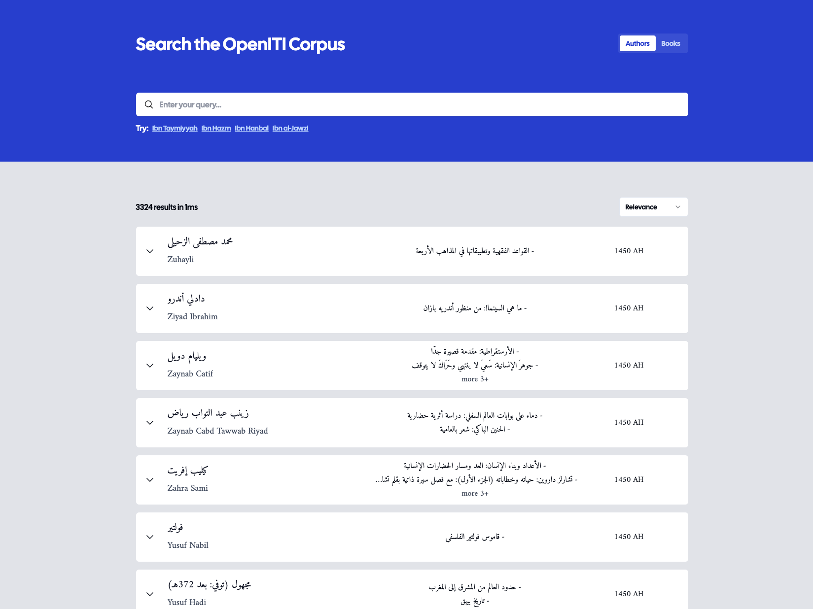

# OpenITI Corpus Search

## Step to setup locally:

1. Clone the repository

2. Run `yarn install`

3. Copy `.env.example` to `.env` and fill in the required environment variables

4. Run `docker-compose up` to start the typesense container

5. Run `yarn index-authors` to index the authors

6. Run `yarn index-titles` to index the titles

7. Run `yarn dev` to start the development server
